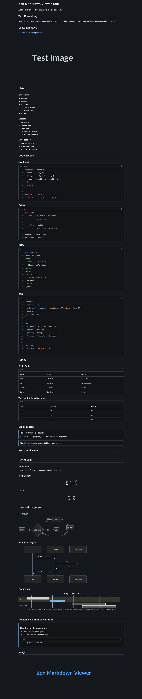

# Zen Markdown Viewer

<p align="center">
  
</p>

A lightweight, keyboard-first markdown viewer that renders `.md` files as styled HTML in your browser — with transparency support, Mermaid diagrams, KaTeX math, and syntax-highlighted code blocks.

- **Transparent background** — compositor blur/transparency (e.g. Hyprland) shows through the page background
- **Markdown rendering** — GFM via marked.js with tables, checkboxes, and footnotes
- **Syntax highlighting** — highlight.js with GitHub Dark theme
- **Mermaid diagrams** — flowchart, sequence, gantt, and more
- **KaTeX math** — inline `$...$` and display `$$...$$` LaTeX
- **Auto-refresh** — polls the file every 3s, re-renders on change
- **Keyboard-first** — vim-style scrolling, heading navigation, transparency toggles
- **Cross-platform** — Linux and macOS via the included launcher script

---

## Requirements

| Dependency | Notes |
|---|---|
| **Python 3** | Ships with macOS 12+; `python3` on Linux |
| **Modern browser** | Chrome, Firefox, Safari, Zen Browser, Edge |
| **curl** (Linux/macOS) | Used by the launcher to download remote `.md` files |
| **Internet** (optional) | CDN-loaded libraries can be vendored locally instead |

---

## Installation

### Nix

Install from the flake (requires [flakes](https://nix.dev/concepts/flakes.html) enabled):

```bash
nix profile install github:HasNate618/zen-markdown-viewer
```

Or build and run from a local checkout:

```bash
git clone https://github.com/HasNate618/zen-markdown-viewer.git
cd zen-markdown-viewer
nix run . -- /path/to/file.md
```

For a one-off install into your profile:

```bash
nix profile install .
```

The package installs `zen-markdown-viewer` on your `PATH` with `viewer.html` bundled in the Nix store. Python 3, curl, and `xdg-open` (Linux) are wrapped automatically.

**NixOS / home-manager** — add the flake as an input and reference `packages.${pkgs.system}.default`, or use an overlay:

```nix
# flake.nix inputs
zen-markdown-viewer.url = "github:HasNate618/zen-markdown-viewer";

# configuration
environment.systemPackages = [ inputs.zen-markdown-viewer.packages.${pkgs.system}.default ];
```

**Dev shell** — for hacking on `viewer.html` without installing:

```bash
nix develop
python3 -m http.server 8765 --bind 127.0.0.1
```

---

### Linux

1. **Clone the repository:**

   ```bash
   git clone https://github.com/HasNate618/zen-markdown-viewer.git ~/Projects/zen-markdown-viewer
   ```

2. **Install the launcher:**

   ```bash
   cp ~/Projects/zen-markdown-viewer/launch.sh ~/.local/bin/zen-markdown-viewer
   chmod +x ~/.local/bin/zen-markdown-viewer
   ```

   Make sure `~/.local/bin` is on your `PATH`.

3. **Test it:**

   ```bash
   zen-markdown-viewer /path/to/file.md
   ```

### macOS

1. **Clone the repository:**

   ```bash
   git clone https://github.com/HasNate618/zen-markdown-viewer.git ~/Projects/zen-markdown-viewer
   ```

2. **Install the launcher:**

   ```bash
   cp ~/Projects/zen-markdown-viewer/launch.sh /usr/local/bin/zen-markdown-viewer
   chmod +x /usr/local/bin/zen-markdown-viewer
   ```

3. **Test it:**

   ```bash
   zen-markdown-viewer /path/to/file.md
   ```

---

## Set as Default Markdown Viewer

### Linux

Run the included install script:

```bash
~/Projects/zen-markdown-viewer/install.sh
```

This creates a `.desktop` entry and registers it with `xdg-mime` so `.md` files open in the viewer by default.

To undo:

```bash
xdg-mime default text.markdown ~/.local/share/applications/zen-markdown-viewer.desktop
rm ~/.local/share/applications/zen-markdown-viewer.desktop
update-desktop-database ~/.local/share/applications
```

### macOS

Create an Automator app (see [zen-pdf-viewer README](https://github.com/HasNate618/zen-pdf-viewer) for detailed steps) pointing at `/usr/local/bin/zen-markdown-viewer`, then assign it as the default for `.md` files in Finder.

---

## Usage

```bash
# Open a local file
zen-markdown-viewer /path/to/file.md

# Open a remote file
zen-markdown-viewer https://example.com/readme.md

# Direct invocation (without installing launcher)
./launch.sh test.md
```

The launcher copies the markdown file to a temporary directory, starts a local HTTP server on a random port bound to `127.0.0.1`, and opens the viewer in your default browser.

---

## Keyboard Shortcuts

| Key | Action |
|---|---|
| `g` / `G` | Scroll to top / bottom |
| `j` / `k` | Scroll down / up |
| `Tab` / `Shift+Tab` | Next / previous heading |
| `Space` | Toggle table of contents sidebar |
| `b` | Toggle background transparency |
| `t` | Toggle text color (black / white) |
| `r` | Force re-render |
| `?` / `Esc` | Open / close help overlay |

---

## URL Parameters

```
http://127.0.0.1:PORT/viewer.html?file=doc.md&t=auto&b=transparent
```

| Parameter | Default | Description |
|---|---|---|
| `file` | *(required)* | Markdown filename served from the local server |
| `t` | `auto` | Text color: `auto` (system-detected), `white`, or `black` |
| `b` | `transparent` | Background: `transparent` or `solid` |

---

## How It Works

1. The **launcher** copies the requested `.md` file alongside `viewer.html` into `/tmp/zen-md.XXXXXX`, then starts `python3 -m http.server` bound to `127.0.0.1`.
2. `viewer.html` fetches the markdown file via `fetch()` and parses it with **marked.js** (GFM mode enabled).
3. KaTeX math is pre-processed before parsing (to avoid conflicts with code blocks), then rendered.
4. Syntax highlighting is applied via **highlight.js** using the GitHub Dark theme.
5. Mermaid ` ```mermaid ` blocks are extracted and rendered as SVGs.
6. The file is polled every 3 seconds — changes are applied automatically without reloading.

All JavaScript libraries are loaded from CDN by default. For offline use, download the libraries and update the `<script>` tags in `viewer.html`.

---

## Troubleshooting

**"viewer.html not found"**
The launcher script couldn't find `viewer.html`. Make sure you're running `launch.sh` from the repo directory or that viewer files have been copied to the expected location.

**Server starts but browser doesn't open**
The launcher uses `xdg-open` (Linux) or `open` (macOS). If neither is available, copy the URL printed in the terminal and open it manually.

**Markdown not rendering**
Check the browser console for errors. If CDN resources are blocked, ensure you have internet access or vendor the libraries locally.

**Mermaid diagrams not showing**
Some mermaid syntax may not render. Check the console for render errors. The raw code block will be shown as a fallback.

---

## Security & Privacy

- The HTTP server binds **only to `127.0.0.1`** — never reachable from the network.
- Files are copied to a temporary directory under `/tmp`.
- Temporary directories are left on disk after the viewer closes. Clean up with `rm -rf /tmp/zen-md.*`.

---

## Contributing

- Fork and open a PR with focused, descriptive commits.
- Keep `viewer.html` as a self-contained single file — no build step, no bundler.
- If you add or change URL parameters or keyboard shortcuts, update both `viewer.html` and this README.
