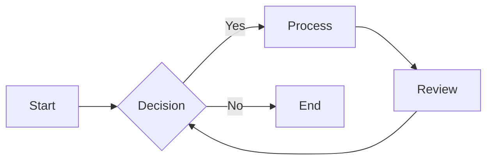
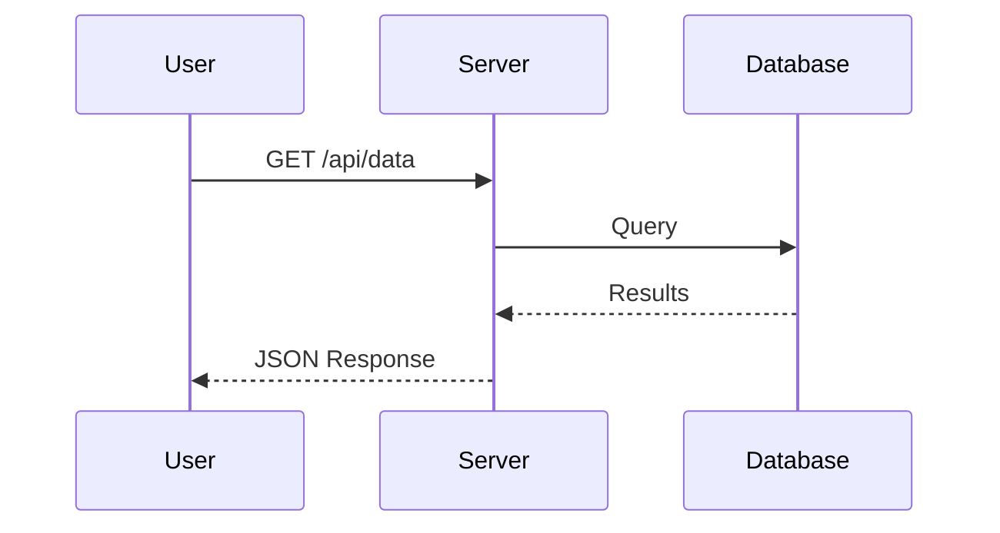
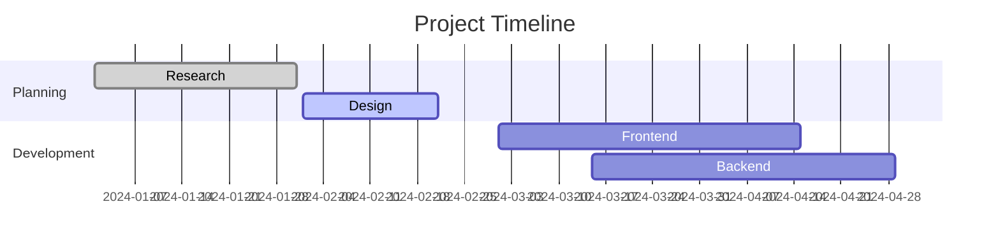

# Zen Markdown Viewer Test


A comprehensive test document for all rendering features.

## Text Formatting

**Bold text**, *italic text*, ~~strikethrough~~, and `inline code`. This paragraph has **multiple** formatting *elements* ~~mixed~~ together.

## Links & Images

[External link to example.com](https://example.com)


## Lists

### Unordered

- Apples
- Bananas
- Cherries
  - Dark cherries
  - Maraschino
- Dates

### Ordered

1. First item
2. Second item
3. Third item
   1. Indented sub-item
   2. Another sub-item

### Checkboxes

- [ ] Unchecked task
- [x] Completed task
- [ ] Another pending item

## Code Blocks

### JavaScript

```javascript
function fibonacci(n) {
  const seq = [0, 1];
  for (let i = 2; i < n; i++) {
    seq.push(seq[i - 1] + seq[i - 2]);
  }
  return seq;
}

console.log(fibonacci(10));
// => [0, 1, 1, 2, 3, 5, 8, 13, 21, 34]
```

### Python

```python
class Greeter:
    def __init__(self, name: str):
        self.name = name

    def greet(self) -> str:
        return f"Hello, {self.name}!"

greeter = Greeter("World")
print(greeter.greet())
```

### HTML

```html
<!DOCTYPE html>
<html lang="en">
<head>
  <meta charset="UTF-8">
  <title>Example</title>
</head>
<body>
  <header>
    <h1>Hello World</h1>
  </header>
</body>
</html>
```

### CSS

```css
.container {
  display: grid;
  grid-template-columns: repeat(auto-fill, minmax(300px, 1fr));
  gap: 1rem;
  padding: 2rem;
}

.card {
  background: var(--bg-secondary);
  border-radius: 8px;
  padding: 1.5rem;
  transition: transform 0.2s ease;
}

.card:hover {
  transform: translateY(-2px);
}
```

## Tables

### Basic Table

| Name | Role | Location |
|------|------|----------|
| Alice | Engineer | New York |
| Bob | Designer | San Francisco |
| Charlie | Manager | London |
| Diana | Developer | Berlin |

### Table with Aligned Columns

| Left | Center | Right |
|:-----|:------:|------:|
| L1 | C1 | R1 |
| L2 | C2 | R2 |
| L3 | C3 | R3 |

## Blockquotes

> This is a standard blockquote.
>
> It can span multiple paragraphs with a blank line separator.

> **Tip:** Blockquotes can contain **bold** and *italic* text too.

## Horizontal Rules

---

## LaTeX Math

### Inline Math

The equation $E = mc^2$ is famous. Also $\alpha^2 + \beta^2 = \gamma^2$.

### Display Math

$$
\sum_{n=1}^{\infty} \frac{1}{n^2} = \frac{\pi^2}{6}
$$

A matrix:

$$
\begin{pmatrix}
a & b \\
c & d
\end{pmatrix}
$$

## Mermaid Diagrams

### Flowchart



### Sequence Diagram



### Gantt Chart



## Nested & Combined Content

> ### Heading inside blockquote
>
> - List item inside blockquote
> - Another item with `inline code`
>
> ```json
> { "key": "value" }
> ```

## Image


